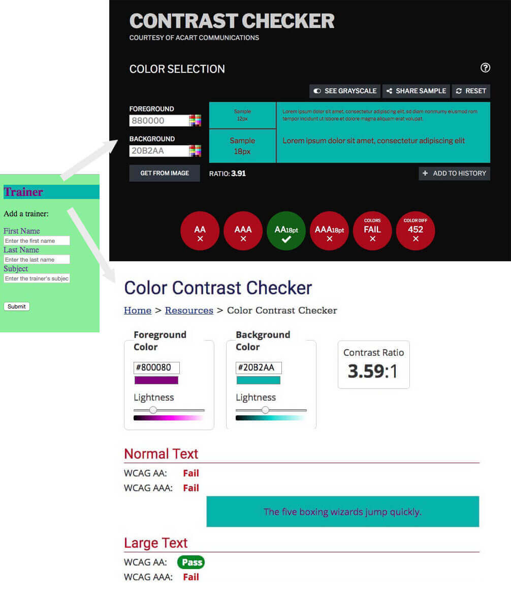

# TIPS FOR DEVELOPERS

### A Beginner's Checklist

## GENERAL

<strong>"Your code needs to look like you cared." 01</strong>

  
The description says it all.

<strong>Organize your Project in folders 02</strong>

  
Example:

  <ul style="list-style:none; font-weight:bold;">
  <li>/</li>
  <li>/cssPlace your CSS files here
  </li>
  <li>/imgPlace your Image files here
  </li>
  <li>/js Place your JavaScript files here
  </li>
  </ul>
  
Example #2:

  <ul style="list-style:none; font-weight:bold;">
  <li>/</li>
  <li>/stylePlace your CSS files here
  </li>
  <li>/imagesPlace your Image files here
  </li>
  <li>/scripts Place your JavaScript files here
  </li>
  </ul>

<strong>Use english language for naming variables, functions, class names and element IDs 03</strong>

  
Avoid Greek or Greeklish.

<strong>Choose Proper Color Sets for your Text and Buttons 04</strong>

  
Contrast and color use are vital to accessibility. Users, including users with visual disabilities, must be able to perceive content on the page.

  
<strong>Always check your color sets with one of the available Contrast Checking services:</strong>

  <ul>
  <li><a href="https://webaim.org/resources/contrastchecker/"><strong>Color Contrast Checker</strong> by WebAIM.org</a></li>
  <li><a href="https://contrastchecker.com/"><strong>Contrast Checker</strong> by Acart Communications</a></li>
  <li><a href="http://accessible-colors.com/"><strong>Accessible Colors</strong></a></li>
  </ul>
  
Bad Example:

  

<strong>Always test your web pages in more than one Browser 05</strong>

Test with at least two or three different browsers and on several screen sizes.

Consider testing the web pages using the Browsers' mobile device emulators

<strong>Do not use local file paths as links 06</strong>

  
Example (wrong):

  <code>
  &lt;link href="C:\Users\John\Desktop\css\style.css" ...&gt;
  </code>
   
   
  
Example (correct):

  <code>
  &lt;link href="./css/style.css" ...&gt;
  </code>

<strong>Keep studying the standards, revisit old code and refactor 07</strong>

  
Make sure that you keep studying the HTML, CSS and JavaScript standards and revisit your old code and try to refactor it using the recently acquired knowledge.

  
Study well-designed forms and interfaces that you commonly use (e.g. Gmail, Search Engines, Contact Forms, etc.) and try to apply the rules and styling guides to your own layouts and web pages.

## HTML

<strong> 01</strong>

  

## CSS

<strong> 01</strong>

  

## JAVASCRIPT

<strong> 01</strong>

  

