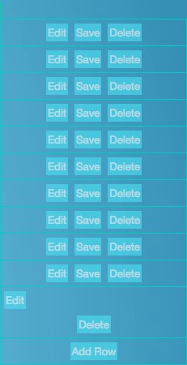
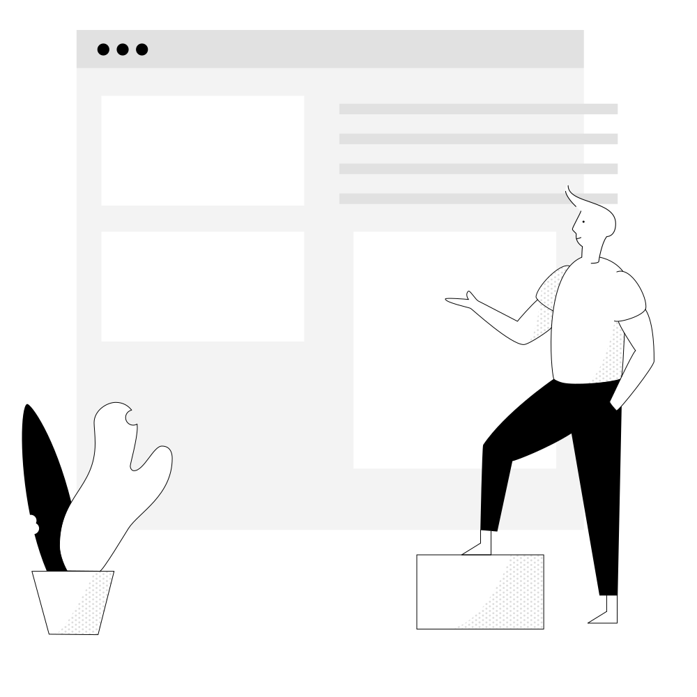
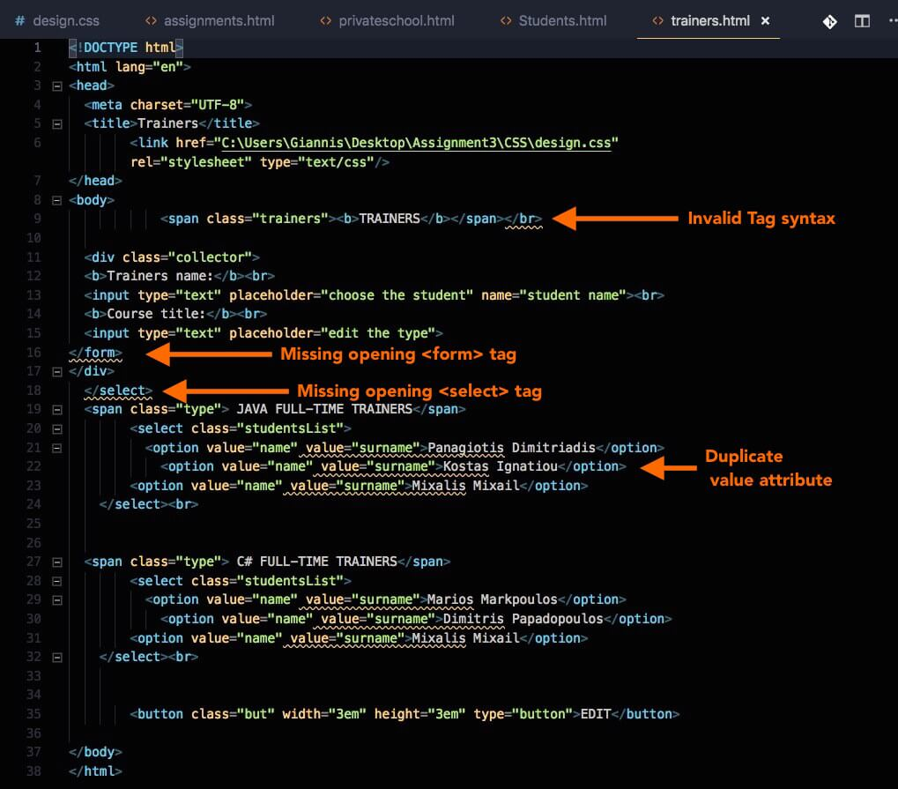
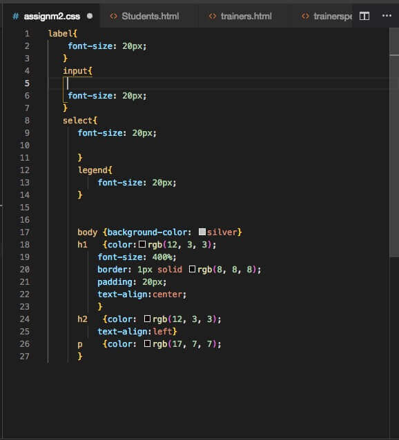
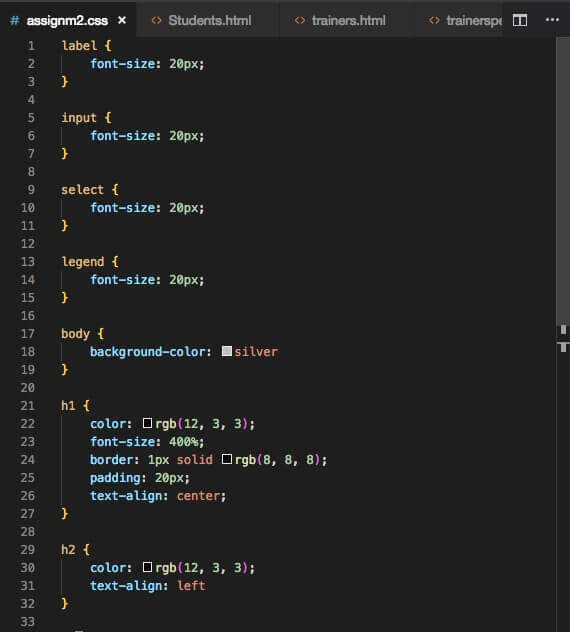
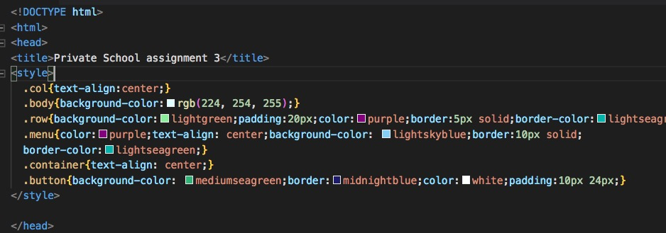
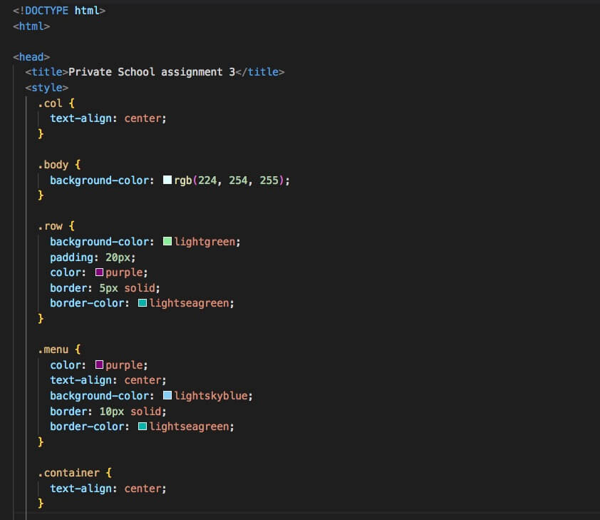

# TIPS FOR DEVELOPERS

### A Beginner's Checklist

- <a href="#general">General<a> 
- <a href="#html">HTML<a> 
- <a href="#css">CSS<a> 
- <a href="#javascript">JavaScript<a> 

## GENERAL

<strong>"Your code needs to look like you cared." 01</strong>

  
The description says it all.

<strong>Organize your Project in folders 02</strong>

  
Place your CSS files in folders named <i>/css</i>, <i>/style</i> or something appropriate. Place your JavaScript files in a folder named <i>/js</i> or <i>/script</i> and your image files in folders named <i>/img</i>, <i>/images</i> or something appropriate. 

  
Example:

  <ul style="list-style:none; font-weight:bold;">
  <li>/</li>
  <li>/css
  </li>
  <li>/img
  </li>
  <li>/js</li>
  </ul>
  
Example #2:

  <ul style="list-style:none; font-weight:bold;">
  <li>/</li>
  <li>/style
  </li>
  <li>/images
  </li>
  <li>/scripts 
  </li>
  </ul>
  
  
Carefully consider the naming convention of your files and folders and <strong>stick to it</strong>, e.g. do not mix different naming styles (uppercase/lowercase/camelCase, etc.): /img/, /js/ CSS/, /fontFiles/

<strong>Use english language for naming variables, functions, class names and element IDs 03</strong>

  
Avoid Greek or Greeklish.

<strong>Choose Proper Color Sets for your Text and Buttons 04</strong>

  
Contrast and color use are vital to accessibility. Users, including users with visual disabilities, must be able to perceive content on the page.

  
<strong>Always check your color sets with one of the available Contrast Checking services:</strong>

  <ul>
  <li><a href="https://webaim.org/resources/contrastchecker/"><strong>Color Contrast Checker</strong> by WebAIM.org</a></li>
  <li><a href="https://contrastchecker.com/"><strong>Contrast Checker</strong> by Acart Communications</a></li>
  <li><a href="http://accessible-colors.com/"><strong>Accessible Colors</strong></a></li>
  </ul>
  
Bad Example:

  
  
  
Bad Example:

  
  

<strong>Always test your web pages in more than one Browser 05</strong>

Test with at least two or three different browsers and on several screen sizes.

Consider testing the web pages using the Browsers' mobile device emulators

<strong>Do not use local file paths as links 06</strong>

  
Example (wrong):

  <code>
  &lt;link href="C:\Users\John\Desktop\css\style.css" ...&gt;
  </code>
   
   
  
Example (correct):

  <code>
  &lt;link href="./css/style.css" ...&gt;
  </code>

<strong>Keep studying the standards, revisit old code and refactor 07</strong>

  
Make sure that you keep studying the HTML, CSS and JavaScript standards and revisit your old code and try to refactor it using the recently acquired knowledge.

  
Study well-designed forms and interfaces that you commonly use (e.g. Gmail, Search Engines, Contact Forms, etc.) and try to apply the rules and styling guides to your own layouts and web pages.

## HTML

<strong>Always Validate your HTML code 01</strong>

  
- Validate your HTML code using the <a href="https://validator.w3.org/">W3C Validator</a>

  
- Use your Code Editor's or IDE built-in validation system or install the appropriate plugins or extensions.

  
- For <a href="https://code.visualstudio.com/">Visual Studio Code</a> you can use the <a href="https://marketplace.visualstudio.com/items?itemName=mkaufman.HTMLHint">HTMLHint Extension</a>.

  
<strong>Examples of validation errors:</strong>

  

  <fieldset>
  <legend>Invalid Tags</legend>
  
Bad code: <code> &lt;/br&gt; </code>

  
<strong>Invalid <code>&lt;/br&gt;</code> tag.</strong> It should be <code>&lt;br&gt;</code>

  </fieldset>

  

  <fieldset>
  <legend>Invalid ID names</legend>
  
Bad code: <code> &lt;input id="Date of birth2"&gt; </code>

  
<strong>An ID must not contain whitespace.</strong>

  </fieldset>

  

  <fieldset>
  <legend>Invalid Element Nesting</legend>
  
Bad code: <code> &lt;a href="#"&gt; &lt;button&gt;Click Me&lt;/button&gt; &lt;/a&gt; </code>

  
<strong>The element button must not appear as a descendant of the a element.</strong><a href="https://stackoverflow.com/questions/6393827/can-i-nest-a-button-element-inside-an-a-using-html5">Reference</a>

  </fieldset>
  
  

  
  
Example output of the the <a href="https://marketplace.visualstudio.com/items?itemName=mkaufman.HTMLHint">HTLMHint VSCode extension</a>:

  

<strong>Make sure you include proper descriptive Document titles 02</strong>

  
- Always use a <strong>&lt;title&gt;</strong> element inside the <strong>&lt;head&gt;</strong> tag

  
- Avoid default Document titles placed by HTML Boilerplate files or Emmet abbreviations, like "Document"

<strong>Be consistent with Table Row and Column Data 03 FORMS</strong>

  
For example, input fields under each column must share common attributes:

  <pre>
&lt;tr&gt;
	&lt;td&gt;&lt;input type=&quot;text&quot;&gt;&lt;/td&gt;
	&lt;td&gt;&lt;input type=&quot;number&quot;&gt;&lt;/td&gt;
&lt;tr&gt;
&lt;tr&gt;
	&lt;td&gt;&lt;input type=&quot;number&quot;&gt;&lt;/td&gt;	&lt;!-- This should have a type=&quot;text&quot; --&gt;
	&lt;td&gt;&lt;input type=&quot;number&quot;&gt;&lt;/td&gt;
&lt;tr&gt;
  </pre>

<strong>Carefully Group your Form Input Elements 04 FORMS</strong>

Recommendend Reading: <a href="https://mattstauffer.com/blog/a-little-trick-for-grouping-fields-in-an-html-form/">A little trick for grouping fields in an HTML form</a>

<strong>Make sure you have a good understanding of HTML Forms and the rules governing each Form Element 05 FORMS</strong>

  
Validate your code to ensure you have no errors in your HTML forms:

  
Avoid errors like placing the <strong>&lt;legend&gt;</strong> element outside of a <strong>&lt;fieldset&gt;</strong> element, and so forth.

  
<strong>Recommended Reading</strong> (Basics):

  <a href="https://developer.mozilla.org/en-US/docs/Web/HTML/Element/form">- Form Element </a> 
  <a href="https://developer.mozilla.org/en-US/docs/Web/HTML/Element/input">- Input Element </a> 
  <a href="https://developer.mozilla.org/en-US/docs/Web/HTML/Element/label">- Label Element</a> 
  <a href="https://developer.mozilla.org/en-US/docs/Web/HTML/Element/select">- Select Element</a> 

<strong>Use Code Formatting 06</strong>

  <ul>
  <li>Use indentation</li>
  <li>Reduce/remove unnecessary whitespace (newlines, tabs, etc.)</li>
  <li>Strive for consistency</li>
	<li>Use automated tools like the <strong>VSCode's</strong> <i>Format Document</i> command to format your code</li>
  </ul>

<strong>Enclose input fields inside &lt;form&gt; tags 07 FORMS</strong>

  
For example, the <strong>&lt;input&gt;</strong> and <strong>&lt;select&gt;</strong> elements must be enclosed inside <strong>&lt;form&gt;</strong> tags.
  

<strong>Avoid using HTML Tags for Formatting or Styling Elements 08</strong>

  
Prefer CSS rules to stylize or format HTML elements

  
 Example: Avoid using &lt;br&gt; for spacing. Try using CSS properties like padding, margin, display, etc.

<strong>Remove unnecessary type="text/javascript" attribute from &lt;script&gt; tags 09</strong>

  
<a href="https://stackoverflow.com/questions/14323376/do-html5-script-tag-need-type-javascript">Reference</a>

<strong>Consider using the &lt;fieldset&gt; tag to organize your form elements into sections 10 FORMS</strong>

  
<strong>Note:</strong> The &lt;fieldset&gt; elements should preferably be used to group two or more input elements.

<strong>Avoid using inline Styling 11</strong>

  
Bad Practice:

  <code>&lt;element style="rule:value" ... &gt;&lt;/element&gt;</code>
  

  
Good Practice:

  
Place your CSS inside <strong>&lt;style&gt;</strong> tags or external CSS files <strong>&lt;link rel="stylesheet"&gt;</strong>

<strong>Avoid using obsolete HTML5 elements and attributes 12</strong>

  
Example: Do not use the <strong>cellspacing</strong> and <strong>cellpadding</strong> <strong>&lt;table&gt;</strong> attributes

  
<a href="https://stackoverflow.com/questions/6048913/in-html5-with-respect-to-tables-what-replaces-cellpadding-cellspacing-valign">Reference</a>

<strong>Organize your &lt;table&gt; Elements using &lt;thead&gt;, &lt;tbody&gt; and &lt;tfoot&gt; sections 13 TABLES</strong>

References: <a href="https://css-tricks.com/complete-guide-table-element/">A Complete Guide to the Table Element</a>

<strong>Consider using &lt;label&gt; elements to accompany &lt;input&gt; and &lt;select&gt; form elements 14 FORMS</strong>

References: <a href="https://developer.mozilla.org/en-US/docs/Web/HTML/Element/label">The label Element</a>

<strong>Always include a name property in your &lt;input&gt; and &lt;select&gt; elements 15 FORMS</strong>

  
- Otherwise the input field values and selected options will never be send to the server.

  
- Consider going through the documentation to ensure that you are placing the `name` attribute only on the elements that require it.

  
  
References: <a href="https://html.com/attributes/input-name/">The <strong>name</strong> input attribute</a>

<strong>Use proper attributes with the &lt;input&gt; elements 16 FORMS</strong>

  
Examples:

  
The <strong>maxlength</strong> attribute is used only with the following input types: text, email, search, password, tel, or url

  
For other control types, it is ignored.

  
<a href="https://stackoverflow.com/questions/18510845/maxlength-ignored-for-input-type-number-in-chrome">References</a>

<strong>Choose your placeholder attribute values wisely 17 FORMS</strong>

 
Bad Example:

 <pre>
 &lt;input type=&quot;text&quot; name=&quot;firstname&quot; placeholder=&quot;John&quot; ...&gt;&#10;
 &lt;input type=&quot;text&quot; name=&quot;lastname&quot; placeholder=&quot;Doe&quot; ...&gt;&#10;
 </pre>

 

 
Goog Example:

 <pre>
    &lt;input type=&quot;text&quot; name=&quot;firstname&quot; placeholder=&quot;First Name&quot; ...&gt;&#10;
    &lt;input type=&quot;text&quot; name=&quot;lastname&quot; placeholder=&quot;Last Name&quot; ...&gt;&#10;</pre>

<strong>Consider using Semantic HTML Elements 18</strong>

Examples of non-semantic elements: &lt;div&gt; - Tells nothing about its content.

Examples of semantic elements: &lt;form&gt;, &lt;table&gt;, &lt;header&gt;, &lt;footer&gt;, &lt;section&gt; and &lt;article&gt; - Clearly define its content.

<a href="https://www.w3schools.com/html/html5_semantic_elements.asp">References</a>

<strong>Use short and descriptive names in your submit elements 19 FORMS</strong>

Avoid:

<pre>
&lt;input type=&quot;submit&quot; value=&quot;Save Changes and Update your Database&quot;&gt;&#10;</pre>

Instead use a short name and an optional description:

<pre>
&lt;input type=&quot;submit&quot; value=&quot;Save&quot;&gt;&#10;&lt;p class=&quot;warning&quot;&gt;Save changes and update your database&lt;/p&gt;
</pre>

<strong>Study Form Design and User Experience 20 FORMS</strong>

A quick search for "guide to better html forms" and "html forms user experience" returned the following useful resources for designing and building better HTML Forms:

- <a href="https://esri.github.io/calcite-web/guides/best-practices/forms/">Forms Best Practices:</a>

- <a href="https://developer.mozilla.org/en-US/docs/Learn/HTML/Forms/Styling_HTML_forms">Styling HTML forms</a>

- <a href="https://medium.com/@Vincentxia77/best-practices-of-6-essential-principles-for-web-form-design-f48bed4708fa">Best Practices of 6 Essential Principles for Web Form Design</a>

- <a href="https://medium.freecodecamp.org/a-step-by-step-guide-to-getting-started-with-html-forms-7f77ae4522b5">A step-by-step guide to getting started with HTML forms</a>

- <a href="https://www.crazyegg.com/blog/guides/great-form-ui-and-ux/">The Crazy Egg Guide to Great Form UI and UX</a>

- <a href="https://uxplanet.org/the-18-must-do-principles-in-the-form-design-fe89d0127c92">16 Tips that Will Improve Any Online Form</a>

- <a href="https://www.ventureharbour.com/form-design-best-practices/">58 Form Design Best Practices & Form UX Examples</a>

- <a href="https://ai.googleblog.com/2014/07/simple-is-better-making-your-web-forms.html">Simple is better - Making your web forms easy to use pays off</a>

- <a href="https://uxdesign.cc/the-ux-behind-designing-better-forms-d6ebe7a817d2">The UX behind designing better forms</a>

Conclusion: Keep digging and search for additional resources!

<strong>Use &lt;select&gt; elements for predefined values 21 FORMS</strong>

When specific input fields have predefined values, consider using &lt;select&gt; elements.

<strong>Careful planning and consideration for field validations 22 FORMS</strong>

 
Bad examples:

 
Using advanced validation patterns without providing the user with proper instructions:

 <pre>&lt;input type=&quot;text&quot; name=&quot;Course Stream&quot; required placeholder=&quot;Course Stream&quot; pattern=&quot;(#)[A-Z,a-z]{2,20}&quot;&gt;&#10;</pre>
 
In the example above, the user is stuck with a required field which requires a very specific pattern of characters to be entered. There is no information to inform the user about the required pattern.

<strong>Avoid using &lt;datalist&gt; for predefined option values 23 FORMS</strong>

	When having a predefined list of options, consider using the &lt;select&gt; element instead of the &lt;datalist&gt;. The &lt;select&gt; element &quot;locks&quot; the users to a specific list of options, whereas the &lt;datalist&gt; enables them to enter arbitrary data and thus be able to submit invalid values.

<strong>When to Use a Datalist</strong>

"Since datalists have no built-in mechanism to require that a user select a provided option, they are well suited for inputs that can accept any value. While the datalist suggests predefined values, the user is free to input any value."

## CSS

<strong>VALIDATE CODE USING W3C CSS Validator 01</strong>

 
<a href="https://jigsaw.w3.org/css-validator/validator">W3C CSS Validator</a>

 
Use VSCode to detect CSS Warnings and Errors

 
Examples:

<pre>
.students {
   display-flex: flex;
   flex-direction: column;
}</pre>
  
<strong>Warning:</strong> Unknown property: display-flex

<strong>Proper Naming for your Selectors, Classes and IDs 02</strong>

  
For example, avoid class names like this:

  <pre>.b { ... }</pre>
  
Instead, use something more descriptive:

  <pre>.submit_button { ... }</pre>
  
Avoid using class names that correspond to HTML Tag names, e.g.

  <pre>
    .h2 { ... }
    .p { ... }
   </pre>
   
Classes can and should be used on multiple elements.

   
Classes should either describe the elements' role in the interface or what they do in terms of styling:

   <pre>
   .title { ... }
   .submit_button { ... }
   .article { ... }
   </pre>
   
Bad choice of class names:

   <pre>
   &lt;input class="button button1"&gt;
   <pre>
    
Better:

    <pre>&lt;input class="submit_button button_border"&gt;</pre>

  
<strong>Avoid using illegible font families such as cursive 03</strong>

  
Avoid:<pre>font-family: cursive;</pre>

  
Prefer sans-serif fonts

<strong>Proper Document Formatting 04</strong>

  
- Consider using VSCode's 'Format Document' command to make your code more readable

  
- Use a CSS Formatting Extension:

  
Install: <a href="https://marketplace.visualstudio.com/items?itemName=lonefy.vscode-JS-CSS-HTML-formatter">JS-CSS-HTML Formatter Extension</a>

  

  
Before Formatting:

  
  
After Formatting:

  
  

  
Before Formatting:

  
  
After Formatting:

  

<strong>Use CSS Group Selector to share CSS Rules among multiple elements 05</strong>

  
Example (Before):

  <pre>
#label {
  font-size: 20px;
}
#input {
  font-size: 20px;
}
select {
  font-size: 20px;
}

legend {
  font-size: 20px;
}
  </pre>
  
Example (After):</p<>
  <pre>
  #label, #input, #select, #legend {
    font-size: 20px;
  }</pre>
  
  
Alternatively, a single class that contained the CSS rule could be applied to all of these elements

<strong>Remove unused/commented CSS 06</strong>

Clean your production code from unused or commented CSS rules. Keep commented code or code that belongs to work in progress to a different git branch and keep you production branch clean.

## JAVASCRIPT

<strong>Prefer the addEventListener() method to add Element Event Handlers 01</strong>

  
Avoid using the HTML inline &lt;element onclick=&quot;&quot;&gt; form.

  
Avoid using the ELEMENT.onclick = function(){} format to add Event Handlers to HTML Elements in your JS code.

  
Prefer the ELEMENT.addEventListener( EVENT, FUNCTION ) format

<strong>Avoid using inline JavaScript 02</strong>

Bad example:

<pre>&#9;&lt;element onclick=&quot;function(){}&quot;&gt;</pre>

Place all your JavaScript code in a &lt;script&gt; Tag or an external .js file

<strong>Proper Naming for Functions and Variables 03</strong>

  
- Name your variables and functions according to what they do.
 
  
- Use verbs for functions and nouns for variables

  
- Try to use descriptive names.
 
  
Bad Examples:

  <pre>
myFunction(){ ... }
myFunction2(){ ... }
</pre>

Good Examples:

<pre>
function openMenu(){ ... }
function closeWindow(){ ... }
</pre>

<strong>Avoid using the == and != Operators 04</strong>

  
- Prefer using the safer === and !== Operators

  
Be sure to google and find what the exact differences between the two are!

<strong>Strive for Code Readability 05</strong>

  
- Use spaces between parentheses, operands, etc. to boost readability. For example:

  <pre>
if(something===1){
  do("argument");
}else{
  apply(2);
}
</pre>

Should preferably look like this:

<pre>
if ( something === 1 ){

    do( "argument" );

} else {

    apply( 2 );

}</pre>

<strong>Avoid using <strong>var</strong> to declare variables. Prefer the <strong>let</strong> and <strong>const</strong> ES6 keywords 06</strong>

<strong>Use the Browser Developer Console to spot code Errors and Warnings 07</strong>

Always work with the Developer Tools console open when working with Web Page that contain JS code, in order to spot JS errors and other warnings.

